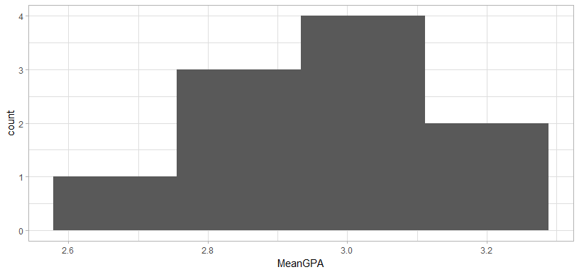

# R Notebook


```r
library(dplyr)
```

```
## 
## Attaching package: 'dplyr'
```

```
## The following objects are masked from 'package:stats':
## 
##     filter, lag
```

```
## The following objects are masked from 'package:base':
## 
##     intersect, setdiff, setequal, union
```

```r
library(tidyr)
library(ggplot2)
library(readxl)
library(ggthemes)
library(magrittr)
```

```
## 
## Attaching package: 'magrittr'
```

```
## The following object is masked from 'package:tidyr':
## 
##     extract
```


```r
Name<-LETTERS[seq( from = 1, to = 5 )]
GPA <- c(3.5, 2.7, 3.1, 3.2, 2.4)
StudentGPA <- data.frame(Name, GPA)
```


#Question 1

```r
#Population of 5, select k=3 - how many combinations?

factorial(5)/(factorial(3)*(factorial(5-3)))
```

```
## [1] 10
```


#Question 2


```r
#Sampling Distribution of Sampling Means
AllSampleSets <- data.frame(t(combn(Name, 3))) %>% mutate(Iteration = row_number())
AllSampleSetsTall<-gather(AllSampleSets, MemberNumber, Name, 1:3)
```

```
## Warning: attributes are not identical across measure variables;
## they will be dropped
```

```r
AllSampleSetsTall <- inner_join(AllSampleSetsTall, StudentGPA, by ="Name")
```

```
## Warning: Column `Name` joining character vector and factor, coercing into
## character vector
```

```r
AllSampleSetsTall %>% group_by(Iteration) %>% summarise(MeanGPA = mean(GPA)) %>% 
  ggplot(aes(x=MeanGPA)) + geom_histogram(bins=4) + theme_light()
```

<!-- -->

```r
#calculate mean of the sampling distribution
AllSampleSetsTall %>% group_by(Iteration) %>% summarise(MeanGPA = mean(GPA)) %>% group_by() %>% summarise(SampleMean = mean(MeanGPA), SampleSE = sd(MeanGPA)/sqrt(n()))
```

```
## # A tibble: 1 x 2
##   SampleMean   SampleSE
##        <dbl>      <dbl>
## 1       2.98 0.05263431
```

```
