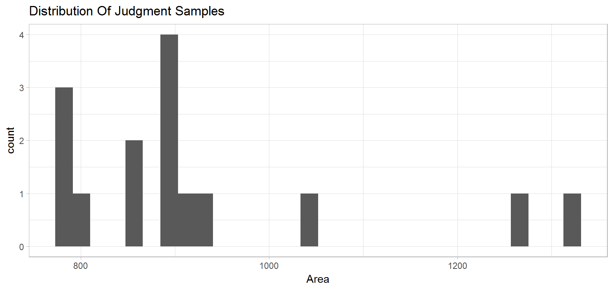
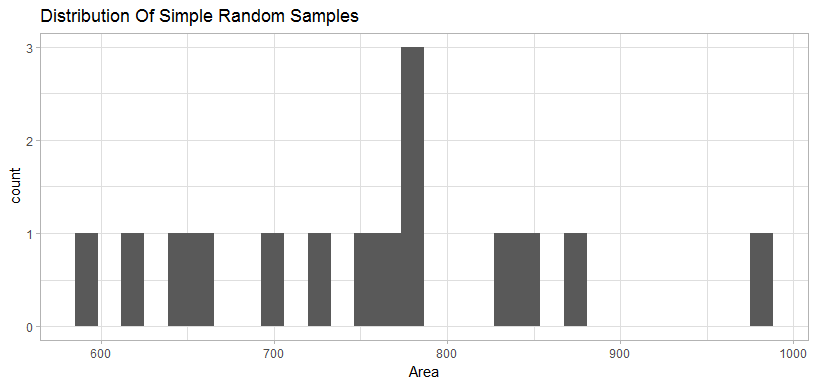
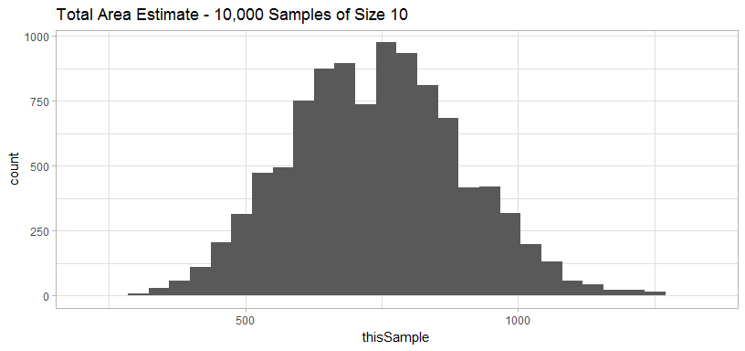

# R Notebook


```r
library(dplyr)
```

```
## 
## Attaching package: 'dplyr'
```

```
## The following objects are masked from 'package:stats':
## 
##     filter, lag
```

```
## The following objects are masked from 'package:base':
## 
##     intersect, setdiff, setequal, union
```

```r
library(tidyr)
library(ggplot2)
library(readxl)
library(ggthemes)
```

#Exercise 1

```r
Rectangle_Response<-read_xlsx("Data/MSDS6370-RectangleExercise.xlsx")

Rectangle_Response <- Rectangle_Response %>% gather("Type", "Area", 2:3)

#Mean of Area
#minimum area
#maximum area
#Number< Mean
#Number >= Mean


Rectangle_Summary <- Rectangle_Response %>% group_by(Type) %>% 
  mutate(meanArea = mean(Area)) %>% 
  mutate(LessThan = ifelse(Area<meanArea, 1, 0), GreaterThan = ifelse(Area>=meanArea, 1, 0)) %>% group_by(Type) %>%
  summarise(minArea = min(Area), maxArea=max(Area), meanArea = mean(Area), greaterThan = sum(GreaterThan), lessThan = sum(LessThan))

Rectangle_Summary
```

```
## # A tibble: 2 x 6
##               Type minArea maxArea meanArea greaterThan lessThan
##              <chr>   <dbl>   <dbl>    <dbl>       <dbl>    <dbl>
## 1 Judgement Sample     650    1350 858.3333           3        9
## 2              SRS     550    1030 770.0833           5        7
```

#Exercise 2

```r
Rectangle2<-read_xlsx("Data/Lab1-Exercise2.xlsx")

Rectangle2 <- Rectangle2 %>% gather("Type", "Area", 2:3)

Rectangle_Summary <- Rectangle2 %>% group_by(Type) %>% 
  mutate(meanArea = mean(Area)) %>% 
  mutate(LessThan = ifelse(Area<meanArea, 1, 0), GreaterThan = ifelse(Area>=meanArea, 1, 0)) %>% group_by(Type) %>%
  summarise(minArea = min(Area), maxArea=max(Area), meanArea = mean(Area), greaterThan = sum(GreaterThan), lessThan = sum(LessThan))
```

#Exercise 3

```r
Rectangle2 %>% filter(Type == "Judgement Sample") %>%
  ggplot(aes(x=Area)) + geom_histogram() + theme_light() +ggtitle("Distribution Of Judgment Samples")
```

```
## `stat_bin()` using `bins = 30`. Pick better value with `binwidth`.
```

<!-- -->
#Exercise 4

```r
Rectangle2 %>% filter(Type == "Simple Random Sample") %>%
  ggplot(aes(x=Area)) + geom_histogram() + theme_light()+ggtitle("Distribution Of Simple Random Samples")
```

```
## `stat_bin()` using `bins = 30`. Pick better value with `binwidth`.
```

<!-- -->


```r
#Mega sample of samples

AllFarms<-read_xlsx("Data/RectangleDims.xlsx")

n_samples <- 10000
sampleSize <-10

i<-1

SampleArea <- data.frame()

while(i <= n_samples){
  
  thisSample<-100*mean(sample(AllFarms$area, sampleSize, replace=FALSE))
  
  
  thisSample<- as.data.frame(thisSample)
  thisSample$sampleNumber<-i
  
  SampleArea<-rbind(SampleArea, thisSample)
  i<-i+1
  
}

SampleArea %>% ggplot(aes(thisSample)) + geom_histogram() + theme_light() + ggtitle("Total Area Estimate - 10,000 Samples of Size 10")
```

```
## `stat_bin()` using `bins = 30`. Pick better value with `binwidth`.
```

<!-- -->

```r
mean(SampleArea$thisSample)
```

```
## [1] 739.428
```


#Exercise 6

```r
#calculate minimum possible sample from size 10:
MinimumSample <- AllFarms %>% 
  top_n(n=10, wt=-area) %>% group_by() %>% summarise(Mean=100*mean(area))

pnorm(1, mean(AllFarms$area),sd(AllFarms$area)/sqrt(10))
```

```
## [1] 5.550023e-05
```

```r
top_n(AllFarms, n=10, wt=area)
```

```
## # A tibble: 15 x 4
##       id     L     W  area
##    <dbl> <dbl> <dbl> <dbl>
##  1    13     2     8    16
##  2    25     6     3    18
##  3    31     4     4    16
##  4    41     2     8    16
##  5    47     4     4    16
##  6    51     8     2    16
##  7    55     4     4    16
##  8    57     6     3    18
##  9    60     2     8    16
## 10    70     6     3    18
## 11    73     8     2    16
## 12    76     3     6    18
## 13    90     4     4    16
## 14    93     2     8    16
## 15    96     3     6    18
```


```r
#calculate minimum possible sample from size 10:
MaximumSample <- AllFarms %>%
  arrange(area) %>% top_n(n=10, wt=area) %>% group_by() %>% summarise(Mean=100*mean(area))

mean(AllFarms$area)
```

```
## [1] 7.39
```

```r
sd(AllFarms$area)
```

```
## [1] 5.227926
```

```r
pnorm(17, mean(AllFarms$area), 5.227/sqrt(10))
```

```
## [1] 1
```


#Exercise 7

```r
#Can we construct a better Judgement Sample of 10?
BestJudgement <- Rectangle2 %>% filter(Type == "Judgement Sample") %>% mutate(DiffFromActual = abs(738-Area)) %>%
  arrange(Area) %>% top_n(10, -DiffFromActual) %>% group_by() %>% summarise(Mean=mean(Area))

MinimumSample2 <- Rectangle2 %>% filter(Type == "Judgement Sample") %>%
  arrange(Area) %>% top_n(10, -Area) %>% group_by() %>% summarise(Mean=mean(Area))

MaximumSample2 <- Rectangle2 %>% filter(Type == "Judgement Sample") %>%
  arrange(Area) %>% top_n(10, Area) %>% group_by() %>% summarise(Mean=mean(Area))

sd(Rectangle2$Area[Rectangle2$Type=="Judgement Sample"])
```

```
## [1] 163.5703
```

```r
mean(Rectangle2$Area[Rectangle2$Type=="Judgement Sample"])
```

```
## [1] 928.6667
```

```r
pnorm(844, mean=928.7, sd=163.5)
```

```
## [1] 0.3022142
```


```r
mean(SampleArea$thisSample)
```

```
## [1] 739.428
```

```r
sd(SampleArea$thisSample)
```

```
## [1] 157.8893
```

```r
pnorm(780, 739.94, 157.4037)
```

```
## [1] 0.6004472
```

```r
pnorm(1320, 739.94, 157.4037)
```

```
## [1] 0.9998857
```

```r
sum(SampleArea$thisSample<=1320 & SampleArea$thisSample>=780)
```

```
## [1] 4068
```

```r
#How close are the judgement samples to the true mean?
filter(Rectangle_Response, Type=="Judgement Sample") %>% mutate(DiffToActual = abs(Area-100*mean(AllFarms$area))) %>% group_by() %>%
  summarise(mean(DiffToActual), sd(DiffToActual))
```

```
## # A tibble: 1 x 2
##   `mean(DiffToActual)` `sd(DiffToActual)`
##                  <dbl>              <dbl>
## 1             142.1667           167.0916
```

```r
SampleArea %>% group_by() %>% mutate(DiffToActual = abs(thisSample - 100*mean(AllFarms$area))) %>% group_by() %>% summarise(mean(DiffToActual), sd(DiffToActual))
```

```
## # A tibble: 1 x 2
##   `mean(DiffToActual)` `sd(DiffToActual)`
##                  <dbl>              <dbl>
## 1             126.8608           93.98902
```
