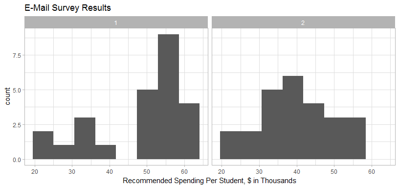
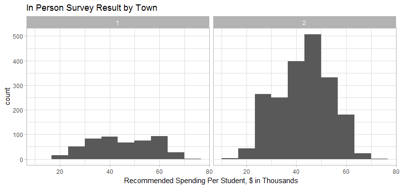

# MSDS 6370 Sampling - Lab 2
Dennis Murray  


```r
library(dplyr)
```

```
## 
## Attaching package: 'dplyr'
```

```
## The following objects are masked from 'package:stats':
## 
##     filter, lag
```

```
## The following objects are masked from 'package:base':
## 
##     intersect, setdiff, setequal, union
```

```r
library(tidyr)
library(ggplot2)
library(readxl)
library(ggthemes)
library(magrittr)
```

```
## 
## Attaching package: 'magrittr'
```

```
## The following object is masked from 'package:tidyr':
## 
##     extract
```

#Exercise 1

```r
Samples <- readxl::read_xlsx("Data/SamplesLab2.xlsx")
```


```r
#Mean and SD for each town
Samples %>% group_by(town) %>% summarise(MeanResponse = mean(response), sdResponse = sd(response), Responses = n())
```

```
## # A tibble: 2 x 4
##    town MeanResponse sdResponse Responses
##   <dbl>        <dbl>      <dbl>     <int>
## 1     1        48.20  11.940826        25
## 2     2        39.76   9.430801        25
```


```r
#Look at Balance by District by Town
Samples %>% group_by(town, District) %>% summarise(MeanResponse = mean(response), sdResponse = sd(response), Responses = n())
```

```
## # A tibble: 10 x 5
## # Groups:   town [?]
##     town District MeanResponse sdResponse Responses
##    <dbl>    <dbl>        <dbl>      <dbl>     <int>
##  1     1        1     35.00000        NaN         1
##  2     1        2     46.50000   7.549834         4
##  3     1        3     53.16667   3.188521         6
##  4     1        4     57.77778   2.905933         9
##  5     1        5     29.00000   5.700877         5
##  6     2        1     47.00000   2.828427         2
##  7     2        2     34.11111   5.348936         9
##  8     2        3     55.00000   1.414214         2
##  9     2        4     29.75000   7.932003         4
## 10     2        5     45.50000   5.154748         8
```

#Exercise 3

```r
#weighted sample

#first pull in the data for each district's percent of residents with email
PercentWithEmail<-read_xlsx("Data/PercentWithEmail.xlsx", sheet="districts")

#Join to respondants
RespondWithEmail <- inner_join(Samples, PercentWithEmail, by=c("town", "District"))

#Create Weighted Response field, Group on Town, summarise mean and Std Dev
RespondWithEmail %>% mutate(WeightedResponse = 1/PctWithEMail * response) %>% group_by(town) %>% summarise(TotalWeight = sum(1/PctWithEMail), TotalWeightedResponse = sum(WeightedResponse)) %>% mutate(MeanResponse = TotalWeightedResponse/TotalWeight)
```

```
## # A tibble: 2 x 4
##    town TotalWeight TotalWeightedResponse MeanResponse
##   <dbl>       <dbl>                 <dbl>        <dbl>
## 1     1    46.98810              2048.548     43.59716
## 2     2    55.83333              2257.500     40.43284
```


```r
FaceSurvey<-read_xlsx("Data/facesurvey.xlsx", sheet="faceSurvey")

FaceSurvey %>% group_by(town) %>% summarise(Mean=mean(response))
```

```
## # A tibble: 2 x 2
##    town   Mean
##   <dbl>  <dbl>
## 1     1 45.172
## 2     2 43.187
```

#Exercise 6

```r
RespondWithEmail %>% ggplot(aes(x=response)) +geom_histogram(bins = 8) + theme_light() + facet_grid(~town) + ggtitle("E-Mail Survey Results") + scale_x_continuous("Recommended Spending Per Student, $ in Thousands")
```

<!-- -->

#Exercise 7

```r
FaceSurvey %>% ggplot(aes(x=response)) +geom_histogram(bins = 10) + theme_light() + facet_grid(~town) + ggtitle("In Person Survey Result by Town") + scale_x_continuous("Recommended Spending Per Student, $ in Thousands")
```

<!-- -->
